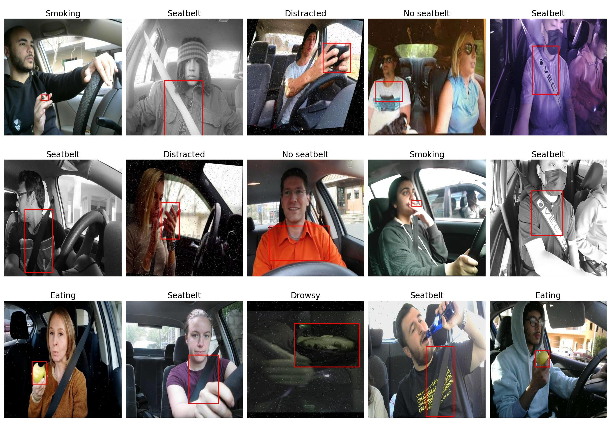
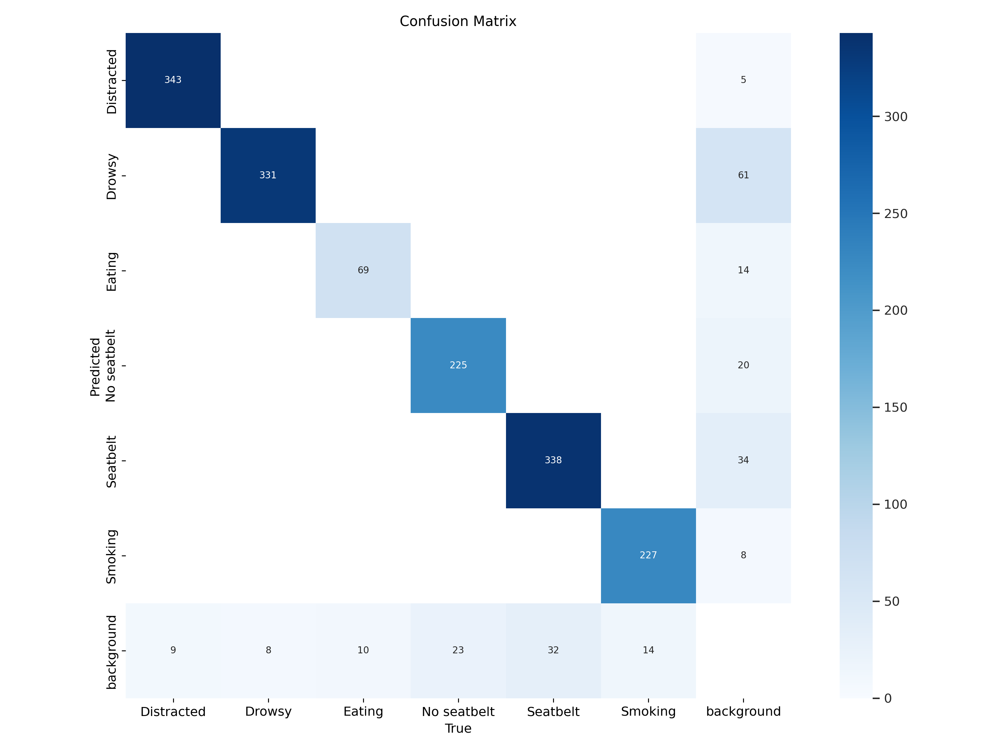
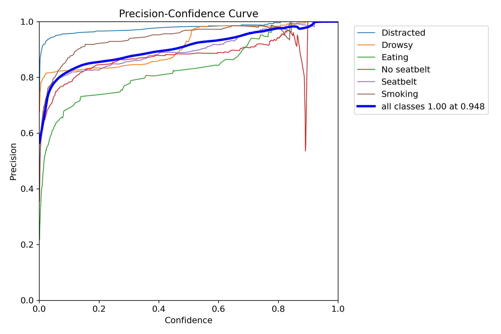
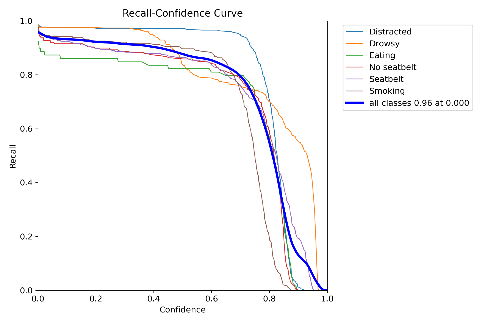
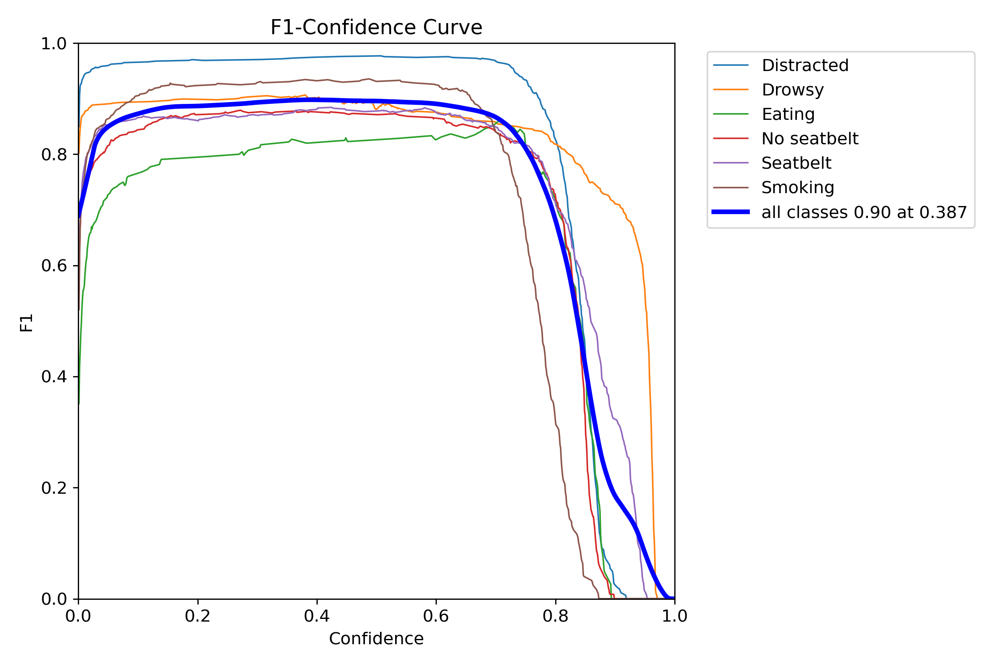
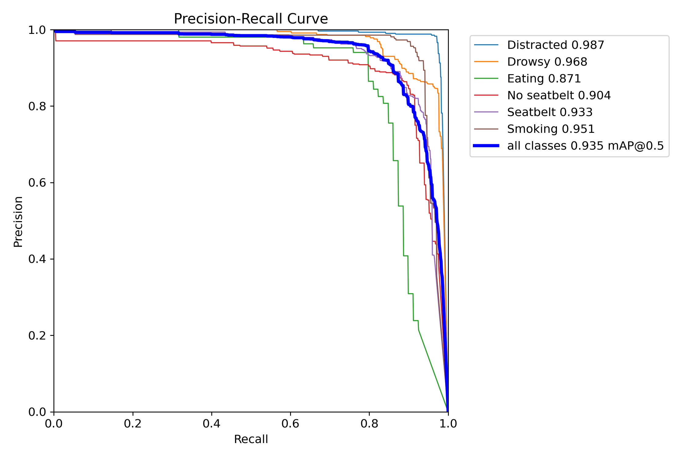
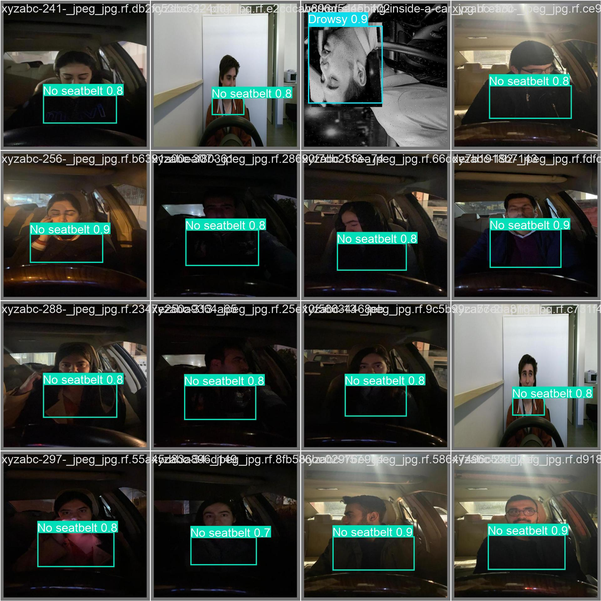
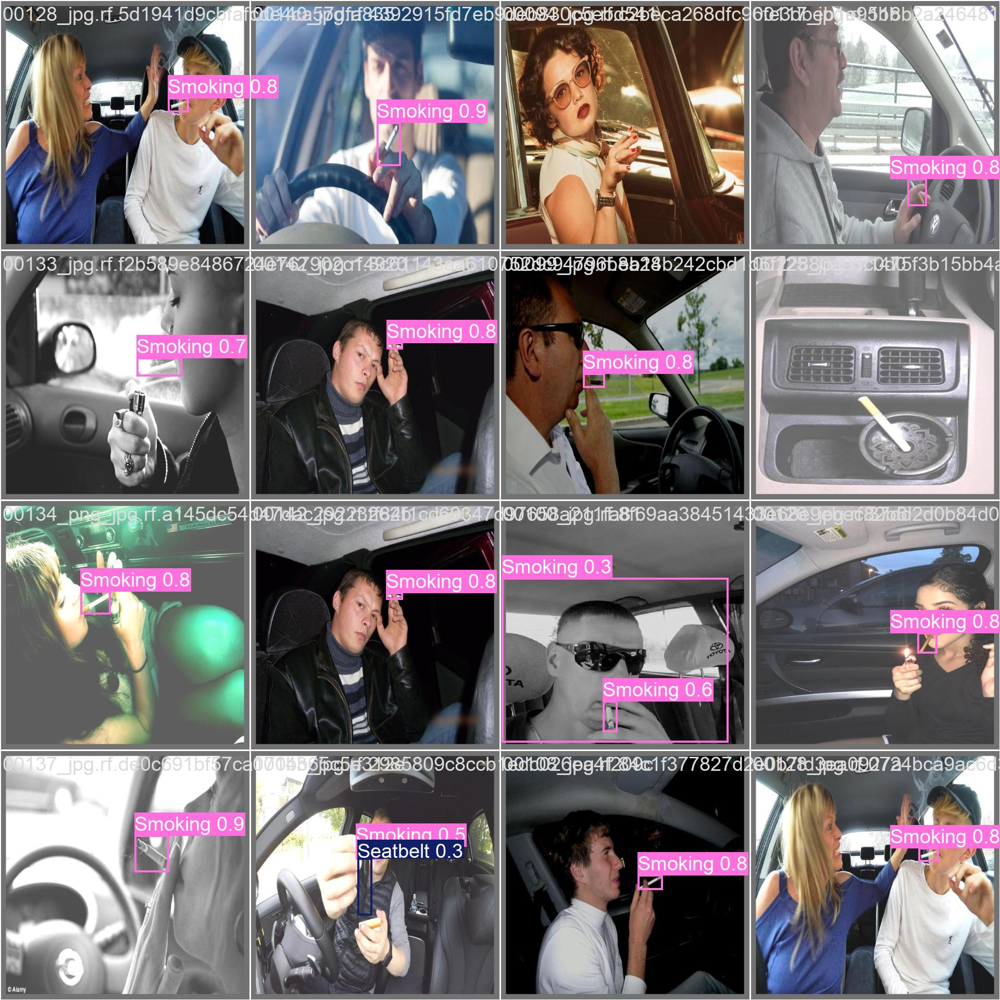

# Driver Behaviour Detection

### Introduction

### Prepare Dataset

I used the dataset on Roboflow, if you would like to use your custom dataset, you can skip this instruction.

Before downloading the dataset, you should login into <a href="https://universe.roboflow.com/">Roboflow</a> to get an api key.

Replace your-api-key by your own api key at <a href="./utils/download_dataset.py">download_dataset.py</a>.

Run the python file to download the dataset:

```bash
python ./utils/download_dataset.py
```

### Visualize Data

I also provided the <a href="./utils/visualize.py">visualize.py</a> in utils to get randomly some samples to demonstrate the annotation.

Configure your path to images and labels folders then run the python file to show examples:

```
python ./utils/visualize.py
```



### Training

Since the training script is strictly followed by Ultralytics instructions, visit <a href="https://docs.ultralytics.com/models/yolo11/">here</a> to read more.

### Performance


<div style="display: flex;">
    
    
</div>

<div style="display: flex;">
    
    
</div>
<div style="display: flex;">
    
    
</div>

### Demo

After completed training, you can deploy the best model as a web-based via <a href="https://anvil.works/">Anvil</a> platform.

Since Anvil's architecture is client-server, you should configure both side.

Client-side:

- Create a blank workspace in Anvil
- Upload the UI code in <a href="./demo/Driver Anomal Behaviour Detection.yaml">Driver Anomal Behaviour Detection.yaml</a> into the Anvil web.

Server-side:

- Create an up-link to connect your app to existing code. The up-link code should be:

```
server_XXXXX...
```

- Open <a href="./demo/demo.ipynb">demo.ipynb</a> notebook and paste your up-link code in:

```
anvil.server.connect("server_XXXXX...")
```

- Ensure the path to weights of your model.
- Press "Run All" to start the session.
